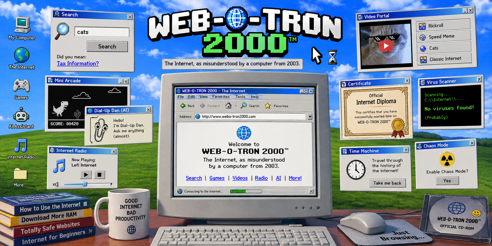

<p align="center">
  
</p>


# WEB-O-TRON 2000™ 🌐💾


## Basic Details

### Team Name: Unoptimized Humans


### Team Members

- Team Lead: Rishi Jayakrishnan - Providence College Of Engineering, Chengannur
- Member 2: Dan Sunil - Providence College Of Engineering, Chengannur


### Project Description

WEB-O-TRON 2000™ is a deliberately useless retro Internet portal that confidently misunderstands everything you search for.

Instead of giving you what you asked for, it sends you into a completely unrelated corner of the Internet, surrounded by fake utilities, games, AI, radio, videos, certificates, system errors, and other completely unnecessary features.


### The Problem (that doesn't exist)

The Internet has become far too useful.

You search for something and actually find it. You click something and it actually works. You ask a question and receive a relevant answer.

WEB-O-TRON 2000™ solves the completely nonexistent problem of the Internet being helpful.


### The Solution (that nobody asked for)

WEB-O-TRON 2000™ deliberately misunderstands the user.

Search for `cats` and you might get taxes.

Search for `football` and you might get gardening.

Search for `Python` and you might get sandwiches.

The system randomly selects an unrelated category, retrieves real Internet content, and presents it through an intentionally broken early-2000s Internet interface.

It is not broken.

It is working exactly as designed.

## Technical Details

### Technologies/Components Used

For Software:

- HTML5
- CSS3
- JavaScript
- Node.js
- Express.js
- Ollama
- Local LLM
- Wikimedia Commons API
- YouTube IFrame Player API
- Web Audio API
- HTML Canvas API
- REST APIs
- Procedural content generation

Tools:

- Visual Studio Code
- Node.js
- npm
- Ollama
- Git
- GitHub
- Chromium / Web Browser

For Hardware:

- No dedicated hardware required


### Implementation

For Software:

WEB-O-TRON 2000™ consists of a browser-based frontend and a Node.js backend.

The frontend contains the retro Internet interface, Wrongness Engine, games, radio, video portal, fake utilities, and other interactive features.

The backend provides the AI gateway that connects the browser to a locally running Ollama model.

The Wrongness Engine intentionally maps user searches to unrelated categories before retrieving Internet content.

# Installation

Clone the repository:

```bash
git clone https://github.com/RishiJayakrishnan2915/useless_project_temp.git
cd useless_project_temp
```

Made with ❤️ at TinkerHub Useless Projects


